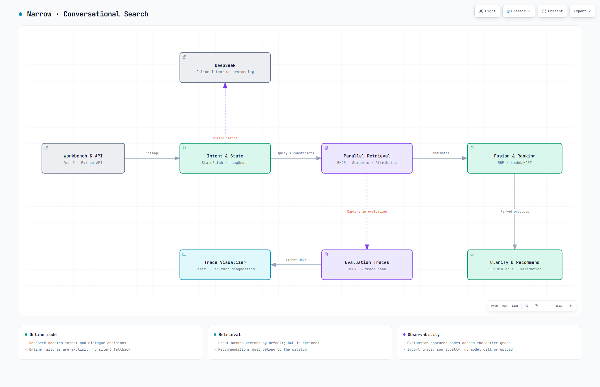

# Narrow

[English (primary)](README.md) · [评委文件指南（英文）](docs/JUDGE_GUIDE.md)

TikTok TechJam 2026 项目已结束，本仓库保留实现、预训练模型和评测流程，作为项目展示与实验记录。完整在线体验需要自行配置兼容的模型 API Key。

多轮对话商品检索。DeepSeek 负责需求理解和对话决策，词法、语义、属性三路召回生成候选，LambdaMART 完成精排。仓库包含已训练的模型、评测器、购物工作台和 Trace 查看器。

<p align="center">
  
</p>

## 架构展示

[系统架构与节点流程](docs/architecture/README.md) · [Archify 交互架构图](docs/architecture/system.html)



交互版请下载 HTML 后用浏览器打开，支持缩放、搜索、主题切换和导出。图中展示主评测使用的 DeepSeek + LambdaMART 配置；工作台需在设置中选择该配置。

## 项目概览

| 项目 | 当前实现 |
|---|---|
| 评测入口 | `techjam-conversational-search/submission_agent.py` 导出 `Agent` |
| 一键评测 | `run_evaluation.ps1` |
| 主运行配置 | DeepSeek V4 Flash 完成理解/对话，冻结的 LambdaMART 完成精排 |
| 本地数据 | 主办方 catalog 与兼容的 JSONL 场景集 |
| 公开 200 条开发结果 | Hit@10 **98.5%**、MRR **0.543222**、MTTC **2.075**、技术分 **0.833967** |
| 网络要求 | 主路径需要 DeepSeek API Key；在线错误不会被离线结果替代 |

公开 200 条参与了受限的模型选择，因此这些数字只作为开发证据，不代表私有测试集表现。当前模型、特征顺序、文件哈希和局限均已随仓库提供。

| 目录 | 用途 | CLI 评分必需？ |
|---|---|---|
| `techjam-conversational-search/` | Agent、评测器、测试、数据格式和当前模型 | 是 |
| `demo-frontend/` | 可选购物工作台 | 否 |
| `trace-visualizer/` | 可选本地 `trace.json` 查看器 | 否 |
| `user-simulator/` | 可选模拟协议 | 否 |
| `docs/` | 文件指南、测试和 Trace 格式 | 参考 |

## Quickstart

环境：Python 3.12、uv。以下命令使用 Windows PowerShell；运行算法不需要 Node.js。

### 1. 安装

```powershell
git clone https://github.com/zhouziyueharry-droid/tiktok_project_4.git
cd tiktok_project_4

uv sync --locked --project techjam-conversational-search --extra web --extra ltr --extra deepseek --group dev
Copy-Item techjam-conversational-search/.env.example techjam-conversational-search/.env
New-Item -ItemType Directory -Force techjam-conversational-search/data/test | Out-Null
```

已有源码时跳过 clone；已有 `.env` 时跳过复制。

### 2. 配置 API

编辑 `techjam-conversational-search/.env`：

```dotenv
DEEPSEEK_API_KEY=your_api_key
DEEPSEEK_BASE_URL=https://api.deepseek.com
DEEPSEEK_MODEL=deepseek-v4-flash
SHOPPING_AGENT_ENABLE_LLM=true
SHOPPING_DENSE_BACKEND=local
LANGSMITH_TRACING=false
```

API Key 只保存在这个文件中，不需要修改 Python 或前端代码。模型调用使用这里配置的模型和地址；已有系统环境变量优先于 `.env`。
`SHOPPING_DENSE_BACKEND=local` 指检索索引在本地运行，不会关闭 LLM。

### 3. 放入数据

```text
techjam-conversational-search/
├── .env
├── data/
│   ├── catalog.jsonl          # 商品目录，先解压 .gz
│   └── test/
│       └── users.jsonl        # 要运行的用户测试集
└── models/
    └── lambdamart_synthetic_2000/   # 已训练的 LambdaMART，随代码提供
```

商品目录由主办方提供。用户测试集使用与 `data/public_set.jsonl` 相同的 JSONL 格式，字段见[数据格式](techjam-conversational-search/data/README.md)。`data/test/` 已加入 Git 忽略规则。

如果先用仓库的公开集验证，在尚未放入自有数据时执行：

```powershell
if (-not (Test-Path techjam-conversational-search/data/test/users.jsonl)) {
    Copy-Item techjam-conversational-search/data/public_set.jsonl techjam-conversational-search/data/test/users.jsonl
}
```

### 4. 运行

在仓库根目录执行：

```powershell
.\run_evaluation.ps1
```

入口读取上述 catalog、用户测试集和 API 配置，使用 **DeepSeek + LambdaMART** 运行全部样本，默认 4 个 worker。终端会显示输入路径、模型、任务启动、完成数量、当前轮次、耗时和预计剩余时间，最后输出评测指标及结果目录。

进度格式如下，具体数字随运行变化：

```text
started shard 1/4: samples=50 pid=...
[progress] 36/200 (18.0%) elapsed=00:02:10 ETA~00:09:52
  w1=9/50 last:public_0033/turn2 | ...
finished shard 1/4: exit=0 remaining=3
```

降低并发：

```powershell
.\run_evaluation.ps1 -Workers 1
```

按 Ctrl+C 停止所有评测 worker，已写出的日志保留。在线评测会调用配置的 API 并产生费用。

## 结果

每次运行写入 `techjam-conversational-search/evaluation_runs/test/<时间戳>/`，不会覆盖前一次结果。`evaluation_runs/test/LATEST.txt` 记录最近一次输出目录。

| 文件 | 内容 |
|---|---|
| `summary.json` / `report.md` | Hit@10、MRR、MTTC、技术分和 token 用量 |
| `sessions.jsonl` / `turns.jsonl` | 逐会话结果、逐轮消息和推荐 |
| `trace.json` | 可导入查看器的诊断结果 |
| `node_traces.jsonl` | 需求状态、各路召回和排序候选 |
| `llm_calls.jsonl` / `rank_calls.jsonl` | 模型调用和精排记录 |
| `run_config.json` | 本次模型、数据路径与运行参数 |
| `shards/` | 各 worker 的数据、日志及运行记录 |

出错时终端会显示中英文说明：启动错误包含文件/参数位置，worker 崩溃包含错误摘要与日志路径，单轮失败包含样本编号、轮次、阶段及原始原因。完整日志仍保存在 `shards/shard_*/stderr.log`。日志包含测试内容，应与测试数据一起管理。

若评测完成但存在失败轮次，仍保留全部结果，`summary.json` 的 `failed_turn_count` 记录数量，命令以非零状态退出；正常全部完成返回 0。错误不会被静默替换成离线结果。

## Python 调用

在 `techjam-conversational-search/` 目录下，使用项目 Python 环境：

```python
from dotenv import load_dotenv
from submission_agent import Agent
from shopping_agent.ranking.lambdamart import LambdaMARTReranker

load_dotenv(".env")

agent = Agent(
    catalog_path="data/catalog.jsonl",
    reranker=LambdaMARTReranker("models/lambdamart_synthetic_2000"),
)
agent.reset("session-1", user_profile={})
result = agent.respond(
    session_id="session-1",
    user_message="I need waterproof shoes under $100.",
    turn=1,
    top_k=10,
)
print(result)
agent.release_session("session-1")
```

`respond` 返回 `message`、`ask_attribute`、按相关性排序的 `recommendations` 和 token `usage`；商品以 `parent_asin` 标识。同一会话沿用 session ID，并递增 turn。用户标签只由评测器读取，不传入 Agent。

本地规则与 Precise 精排保留用于调试和对照；上面的评测入口固定使用在线理解、在线对话与 LambdaMART。在线异常会记录为失败，不会用离线结果替换。

## 工作台与 Trace

需要 Node.js 22.13+ 的兼容版本。在仓库根目录安装前端并启动：

```powershell
npm --prefix demo-frontend ci --no-audit --no-fund
npm --prefix trace-visualizer ci --no-audit --no-fund
.\scripts\run_demo.ps1 -SkipInstall
```

- 工作台：[http://127.0.0.1:5173](http://127.0.0.1:5173)。启动后在设置中选择 **DeepSeek + LambdaMART** 并保存，用于聊天和页面评测。
- Trace 查看器：[http://127.0.0.1:3000](http://127.0.0.1:3000)。导入本次 CLI 生成的 `trace.json`。
- HTTP API：[http://127.0.0.1:8000/api/health](http://127.0.0.1:8000/api/health)。

CLI 结果不自动加入网页运行历史。网页 Native / TechJam 评测使用公开集；自有用户测试集通过 `run_evaluation.ps1` 运行。

## 文档

| 文档 | 用途 |
|---|---|
| [评委文件指南（英文）](docs/JUDGE_GUIDE.md) | 完整仓库地图及必需/可选文件 |
| [代码测试与评测](docs/TESTING.md) | 离线测试、在线评测和生成产物 |
| [模块架构](techjam-conversational-search/docs/agent_architecture.md) | 运行图、状态、召回和可靠性边界 |
| [LambdaMART 训练](techjam-conversational-search/docs/lambdamart_training.md) | 数据隔离、特征、训练和复现 |
| [MRR 训练](techjam-conversational-search/docs/mrr_training.md) | 当前损失函数和受限比较流程 |
| [Flash 对比结果](techjam-conversational-search/docs/mrr_loss_search_20260901.md) | 公开开发分、选择规则和局限 |
| [演示工作台](demo-frontend/README.md) | 可选网页界面、本地 API 行为和文件地图 |
| [Trace 查看器](trace-visualizer/README.md) | 本地查看方式和文件地图 |
| [用户模拟器](user-simulator/README.md) | 可选 TechJam/Realistic 模拟协议 |
| [Trace 格式](docs/TRACE_JSON_FORMAT.md) | 可移植 `trace.json` 格式 |
| [数据来源](techjam-conversational-search/DATA_ATTRIBUTION.md) | 数据来源与使用边界 |
