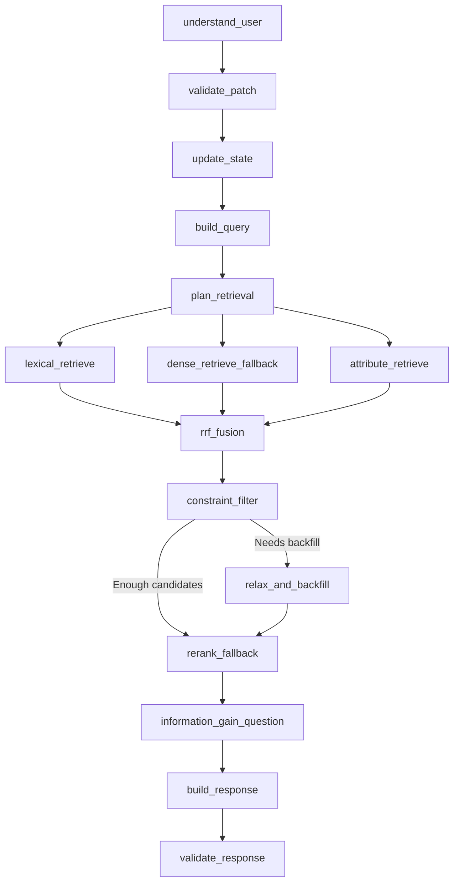

# Narrow architecture

[Project home](../../README.md) · [Interactive Archify diagram](system.html) · [Editable specification](system.architecture.json)

The overview depicts the **DeepSeek + LambdaMART** configuration used by the main evaluation entry. It describes the local application, not a production deployment. Workbench settings choose the provider and ranker; direct graph construction still defaults to `PreciseReranker` unless a ranker is injected.

## From a message to recommendations

1. **Interpret and validate.** DeepSeek produces a bounded intent patch. Online provider, parsing, and validation errors fail explicitly; offline parsing is a separate mode.
2. **Maintain state.** Apply constraints, negation, replacements, and no-preference fields to session state. The default checkpoint saver is in memory.
3. **Plan retrieval.** Build query representations and a retrieval plan, then run lexical, semantic, and attribute retrieval in parallel.
4. **Fuse and filter.** Weighted reciprocal-rank fusion combines candidates. Constraints are applied centrally; insufficient survivors trigger backfill.
5. **Rerank.** The configured frozen LambdaMART bundle scores candidates. Precise remains available for local comparisons and direct default construction.
6. **Choose the dialogue action.** Candidate attribute coverage, entropy, and representative values inform DeepSeek's question or recommendation decision. Offline mode uses deterministic dialogue policy.
7. **Validate output.** Enforce catalog membership, unique product identifiers, Top-K limits, allowed question attributes, and usage accounting.

## Runtime node map

Identifiers match [`orchestration/graph.py`](../../techjam-conversational-search/src/shopping_agent/orchestration/graph.py). Compatibility names ending in `_fallback` do not imply that online failures fall back silently.



## Application and evaluation boundaries

The Vue workbench calls the local Python API for chat, settings, evaluation, and run history. The agent owns conversation state; the evaluator owns hidden targets and scoring. The compatibility interface is `reset/respond`, while real-user sessions use `start_session/chat`.

Traced evaluation records sessions, turns, and graph-node evidence. The React trace viewer consumes a generated `trace.json`; selecting a local file parses it in the browser without uploading it or calling a model. The overview's retrieval-to-trace arrow represents instrumentation across the graph, including intent, ranking, and response nodes. Truncated historical snapshots can leave ranks unknown.

The optional user simulator supports exact-target TechJam behavior and need-based realistic goals. Deterministic policy controls behavior and acceptance; an optional verbalizer changes wording. These protocols use different success definitions and should be reported separately.

## Code reading guide

| Concern | Source |
| --- | --- |
| Graph assembly | [`orchestration/graph.py`](../../techjam-conversational-search/src/shopping_agent/orchestration/graph.py) |
| Session API | [`application/service.py`](../../techjam-conversational-search/src/shopping_agent/application/service.py) |
| HTTP API and runtime settings | [`web.py`](../../techjam-conversational-search/src/shopping_agent/web.py) |
| Retrieval routes and fusion | [`retrieval/`](../../techjam-conversational-search/src/shopping_agent/retrieval/) |
| LambdaMART implementation | [`ranking/lambdamart.py`](../../techjam-conversational-search/src/shopping_agent/ranking/lambdamart.py) |
| Frozen model provenance | [`model README`](../../techjam-conversational-search/models/lambdamart_synthetic_2000/README.md) |
| Detailed intent and dialogue boundaries | [`agent_architecture.md`](../../techjam-conversational-search/docs/agent_architecture.md) |
| Workbench | [`demo-frontend/README.md`](../../demo-frontend/README.md) |
| Trace viewer | [`trace-visualizer/README.md`](../../trace-visualizer/README.md) |
| Evaluation and checks | [`docs/TESTING.md`](../TESTING.md) |
| Optional user simulator | [`user-simulator/README.md`](../../user-simulator/README.md) |

## Diagram regeneration and evidence

With Archify installed, replace `<archify>` with its skill directory and run from the repository root:

```bash
node <archify>/bin/archify.mjs validate architecture docs/architecture/system.architecture.json --quality showcase --json
node <archify>/bin/archify.mjs deliver architecture docs/architecture/system.architecture.json docs/architecture/system.html --quality showcase --json
node <archify>/bin/archify.mjs visual-check docs/architecture/system.html --json
```

Implementation reviewed at `b8964a8ef23191c70dd035f71a6ebc5de54b871d`.

| Evidence | Result |
| --- | --- |
| Diagram type | `architecture` |
| Validation | 9/9 showcase checks; 0 composition errors; 0 warnings |
| Automated browser evidence | Passed at 1440×900, 1600×1000, 1920×1080, and 2048×1320 |
| Perceptual review | Passed: inspected 1440×900 light and 2048×1320 dark screenshots |
| Correction rounds for this revision | 0 |
| Specification bytes | 2309 |
| HTML bytes | 708558 |

Specification SHA-256: `d599fc9c94e63b8119df672e8ce48c1eca5b0e09ce27a031cd93896935dbda81`

HTML SHA-256: `c01fd2eed33ccc1fb1dcbf64ed8d475923940d72ca552c13f86ece3b72cdef66`

The [automated receipt](system.visual-check.json) binds measurements to the exact HTML. Its perceptual-review field remains pending by design; the separate review above records the inspected screenshots. See the [contact sheet](system.visual-check.html) for all four previews.
